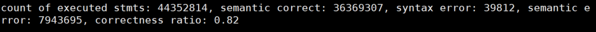

# 典型DBMS模糊测试工具评测

许多DBMS模糊测试工具采用了不同的方法，并且在自身的评估实验中表现出了优异的性能。但是由于评测方式的多样性和不统一则会对评估的有效性产生威胁，使得工具的使用者和研究者对于工具的效果缺乏准确的认知。因此，本章从对目标数据库的覆盖率，合成查询的语法和语义正确性，和发现的崩溃上评估了典型的DBMS模糊测试工具SQLsmith、Squirrel、LEGO、Griffin、SQLancer、SQLRight、Apollo来对它们进行直观的比较。其中，SQLsmith、Squirrl、LEGO、Griffin是针对数据库崩溃问题进行检测的最先进工具，SQLancer和SQLRight是针对数据库性能问题进行检测的最先进工具，Apollo是目前唯一开源的针对数据库性能问题进行检测的工具。

## 实验设置

**测试的DBMS**。为了评估各个工具的通用性和效率，我们选择了被大部分工具采用的三个流行的开源DBMS进行评测，即PostgreSQL, MySQL和SQLite。这些DBMS在工业中被广泛使用并且经过了大量的测试。其中，SQLsmith目前官方支持PostgreSQL和SQLite，SQLancer和SQLRight运行时均采用了NoREC测试准则。但由于SQLancer没有在MySQL上实现NoREC，所以我们用TLP进行代替。SQLsmith和Squirrel测试的DBMS均插入了AddressSanitizer，其余的均直接采用默认模式编译。基于变异的模糊测试工具均使用它们默认的初始种子进行测试。

**实验环境**。我们在一台运行64位Ubuntu 20.04的机器上进行实验，它有128个内核（AMD EPYC 7742处理器@2.25 GHz）和488 GiB的主内存。所有测试的DBMS都在docker容器中运行，可以直接从其网站下载。为了进行定量比较，我们用40GiB的内存运行PostgreSQL, MySQL和SQLite的docker容器。实验的测试时间设置为24小时，这是因为目前大部分对模糊测试工具的评测工作都采用24小时作为通用的时间。

**测试过程**。下图描述了实验的测试过程。具体包含四步，即环境准备、DBMS构建、测试执行、结果收集。第一步是环境准备，此步骤需要准备环境和测试工具。具体需要下载待测试工具源码，部分工具需要修改加入查询有效性插件以进行查询正确性的统计，通过其构建指令构建可执行的工具二进制。第二步是DBMS构建，此步骤用来构建测试所需要的二进制。具体需要获取待测DBMS源码，构建待测工具需要构建的版本及基于LLVM源代码覆盖率收集的所需指令编译的对应版本。第三步是测试执行，此步骤用来进行实际测试。首先通过构建包含Fuzzer和待测DBMS的实例进行试验测试。如果试验测试存在问题，则需要退回前两步进行问题的修改。如果试验测试通过，则进行实际测试。

最后一步是结果收集，此步骤用来统计各个工具的各项指标。在对每个工具的评测中，我们使用了基于LLVM的源代码覆盖率收集方式，以获取被测数据库管理系统的覆盖信息。这些覆盖率数据可以帮助我们评估测试用例的有效性和对数据库系统代码的探索程度。除了覆盖率数据之外，我们还收集了其他两个关键指标：语法语义正确性和漏洞发现总数。语法语义正确性表示工具生成的模糊测试用例是否符合数据库系统的语法规则和语义约束。我们对每个生成的测试用例进行语法和语义验证，以确定其有效性。漏洞发现总数是另一个指标，我们不仅统计了在24小时之内各个工具实际发现的漏洞，同时我们也统计了各个工具到本文写作时已经发现的总的漏洞个数，以进行相对全面的比较。

##  覆盖率

### 统计结果

| 数据库   | PostgreSQL |      | MySQL |      | SQLite |      |
| -------- | ---------- | ---- | ----- | ---- | ------ | ---- |
| 类别     | 行         | 分支 | 行    | 分支 | 行     | 分支 |
| SQLsmith | 33%        | 25%  | --    | --   | 27%    | 22%  |
| Squirrel | 15%        | 11%  | 24%   | 17%  | 59%    | 49%  |
| LEGO     | 58%        | 43%  | 37%   | 27%  | 57%    | 47%  |
| Griffin  | 50%        | 37%  | 34%   | 25%  | 59%    | 52%  |
| SQLancer | 34%        | 26%  | 28%   | 20%  | 52%    | 44%  |
| SQLRight | 42%        | 30%  | 25%   | 18%  | 60%    | 50%  |
| Apollo   | 33%        | 25%  | --    | --   | 26%    | 20%  |

### 结果截图

SQLsmith在PostgreSQL上覆盖率结果的截图为：

SQLsmith在Sqlite上覆盖率结果的截图为：

Squirrel在PostgreSQL上覆盖率结果的截图为：

Squirrel在MySQL上覆盖率结果的截图为：

Squirrel在Sqlite上覆盖率结果的截图为：

LEGO在PostgreSQL上覆盖率结果的截图为：

LEGO在MySQL上覆盖率的结果截图为：

LEGO在Sqlite上覆盖率的结果截图为：

Griffin在PostgreSQL上覆盖率结果的截图为：

Griffin在MySQL上覆盖率结果的截图为：

Griffin在Sqlite上覆盖率结果的截图为：

SQLancer在PostgreSQL上覆盖率结果的截图为：

SQLancer在MySQL上覆盖率结果的截图为：

SQLancer在SQLite上覆盖率结果的截图为：

SQLright在PostgreSQL上覆盖率结果的截图为：

SQLright在MySQL上覆盖率结果的截图为：

SQLright在SQLite上覆盖率结果的截图为：

Apollol在PostgreSQL上覆盖率结果的截图为：

Apollo在SQlite上覆盖率结果的截图为：

## 表达式有效性

### 统计结果

| 数据库   | PostgreSQL |      | MySQL |      | SQLite |      |
| -------- | ---------- | ---- | ----- | ---- | ------ | ---- |
| 类别     | 语法       | 语义 | 语法  | 语义 | 语法   | 语义 |
| SQLsmith | 100%       | 38%  | --    | --   | 82%    | 39%  |
| Squirrel | 100%       | 64%  | 97%   | 89%  | 97%    | 72%  |
| LEGO     | 92%        | 56%  | 80%   | 63%  | 90%    | 52%  |
| Griffin  | 100%       | 59%  | 100%  | 82%  | 100%   | 96%  |
| SQLancer | 79%        | 33%  | 100%  | 97%  | 100%   | 97%  |
| SQLRight | 98%        | 76%  | 99%   | 72%  | 97%    | 75%  |
| Apollo   | 100%       | 13%  | --    | --   | 26%    | 7%   |

### 结果截图

SQLsmith在PostgreSQL上运行：

SQLsmith在SQLite上运行：

Squirrel在PostgreSQL上运行

Squirrel在MySQL上运行

Squirrel在sqlite上运行

LEGO在PostgreSQL上运行

LEGO在MySQL上运行

LEGO在SQLite上运行

Griffin 在PostgreSQL上运行

Griffin在MySQL上运行

Griffin在SQLite上运行

SQLancer在PostgreSQL上运行 

SQLancer在MySQL上运行

SQLancer在SQLite上运行

SQLright在PostgreSQL上运行

SQLright在MySQL上运行

SQLright在sqlite上运行

Apollo在PostgreSQL上运行

Apollo在SQLite上运行

